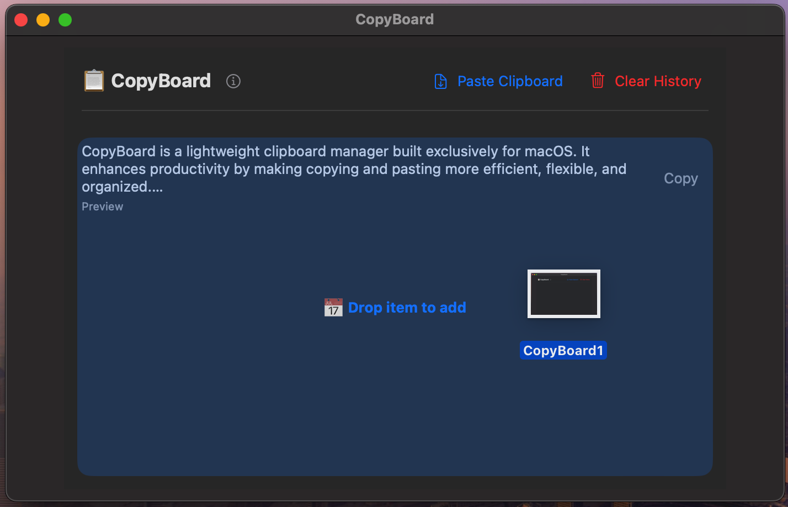

# CopyBoard

**CopyBoard** is a lightweight clipboard manager built exclusively for **macOS**. It enhances productivity by making copying and pasting more efficient, flexible, and organized.

---

## Why CopyBoard?

Unlike the native macOS clipboard that only remembers your most recent copy, CopyBoard gives you full control over your clipboard history. It allows you to:

- Quickly re-copy previous text, links, and code snippets
- View and reuse copied images and files
- Automatically track clipboard changes or manually paste items
- Preview longer text entries
- Drag and drop content directly into the app interface

---

## Key Features

- Clipboard history for text, images, and files
- Drag-and-drop support for files and content
- Manual paste functionality
- Clickable links for easy access
- Text preview for long copied content
- Clear clipboard history with a single click
- Option to launch at login
- Designed for macOS dock and menu bar

---

## Installation

### Install on macOS via `.dmg`

1. [Download CopyBoard.dmg](https://github.com/ashworth3/CopyBoard/releases/latest)
2. Open the downloaded file
3. Drag **CopyBoard.app** into your Applications folder
4. Launch the app and optionally enable **Launch at Login**

> Note: You may be prompted to grant permissions under **System Settings > Privacy & Security > Accessibility**

---

## Usage Tips

Click **Copy** on any saved item to instantly reuse it. CopyBoard also helps keep things tidy by automatically ignoring duplicate clipboard entries.

---

  Engineered for macOS by <a href="https://github.com/ashworth3">@ashworth3</a>

---

## Screenshots

Here’s a look at CopyBoard:

### 1. App Preview

### 2. Drag and Drop

### 3. History Saves

